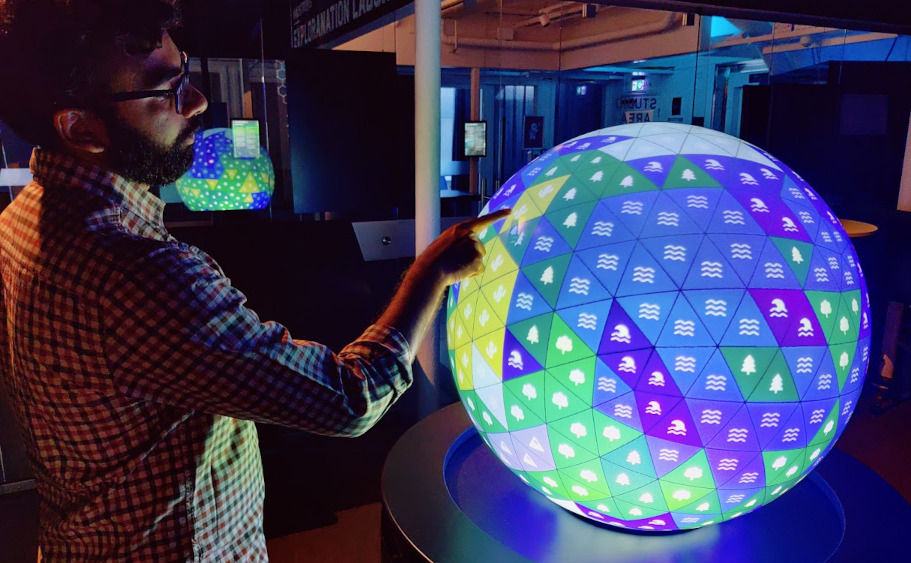
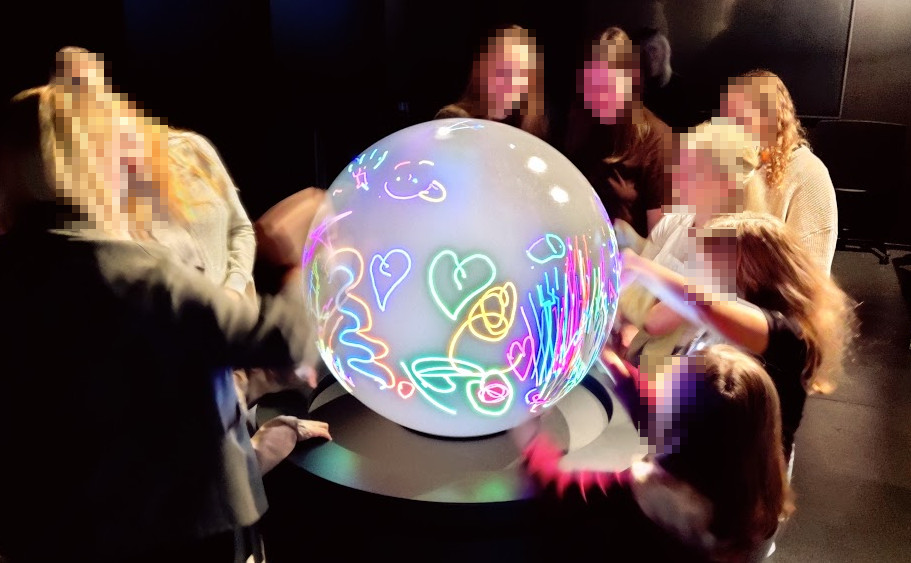

# Tellus Demo

<div style="display: flex; gap: 16px;">
	<div>
		
	</div>
	<div>
		
	</div>
</div>

Tellus Demo is a work-in-progress web/desktop demo for the Tellus project. Many features and models are experimental.

Contact: mans.gezelius@liu.se


## Installation

This project has no executable version yet. You need to run the source code in a console on the same computer as the Tellus globe.

System requirements: Windows 10/11, Microsoft Edge 89+ and [WebView2](https://go.microsoft.com/fwlink/p/?LinkId=2124703) (usually installed by default).

Start by opening PowerShell:
- Go into the unzipped project folder
- Shift + right click on the background
- Click "Open PowerShell window here"


### Node

This project uses Node.js 20. Install it via NVM for Windows.
- Visit https://github.com/coreybutler/nvm-windows/releases
- Scroll down to "Assets"
- Download `nvm-setup.exe`

```powershell
# Run these commands in PowerShell
nvm install 20
nvm use 20
node -v # Should print a version starting with v20
```


### Python

This project uses a Python proxy to listen to Tellus touch interactions over TuIO.

- Install [Python](https://www.python.org/downloads/)
	- Click "Add python.exe to PATH" before clicking "Install Now"

```powershell
# Create and activate a virtual environment
python -m venv .venv
.\.venv\Scripts\Activate.ps1

# Install packages
python -m pip install --upgrade pip
pip install python-osc websockets

# Run the proxy and allow network access
python .\proxy\proxy.py

# Press ctrl-C to exit
```

The app attempts to start `proxy/proxy.py` automatically. If Python is not installed or not on PATH, startup will fail and you can run the proxy manually using the commands above.


### Project modules

With all prerequisites installed, the last step is to install the project itself. Run these commands in PowerShell in the project folder.

```powershell
# Installs node modules. Takes a few minutes
npm install

# Run the app
npm run dev-neu
```

Upon starting the application, minimize the debug console


---

## Running the demo

Once everything is installed, you can run the demo and modify the code live to tweak settings. Use any text-editor and open files in the project. Any changes you make will appear immediately.

- **Start the demo**: Open PowerShell in the demo folder and run `npm run dev-neu`
- **Reset the demo**: Click the application and press F5
- **Stop the demo**: Tab to PowerShell and press ctrl-C, or use alt-F4


### Switch between PlanetCreator and Drawing

The demo contains two applications: a **planet creator** with clickable tiles, and a **drawing demo**.

How to switch demo:
- Open `src/main.ts`
- Change `main_3d` to `main_draw`, or vice versa
- Save the file


### Change the number of planet tiles

All available models are found in comments. **Goldberg** models consist of pentagons and hexagons. **Geodesic** models consist of triangles.

- Open `src/main_3d.ts`
- Look for the `import model from "@/geometry/models/xxx.json"` you want to test
- Add `//` to the current model. Remove `//` from the model you want to test
- Save the file


### Planet tile graphics

Here is how you can change the visual appearance of the planet.

- Open `src/constants.ts`
- Change constant values. Suggestions:
	- `VERTEX_COLOR`, `EDGE_COLOR` — change line colors
	- `VERTEX_SIZE`, `EDGE_SIZE` — change line width
- Save the file


### Mobile interactive demo

The planet creator comes with a network based mobile interactive demo. Multiple people can join the exhibition and interact with it live.

- Visit https://omni.itn.liu.se/ on a phone or computer
- Click "guest"
- Enter password "EAGM"
	- This is temporary. The actual password is going to appear in the debug console and will be displayed on the globe for visitors
- Move the joystick to control a fish character

Read more about the technology here: https://immvis.github.io/guides/omni/


---

## Running without a Tellus globe

If you want to test the app locally without the interactive globe hardware, you can use the official Tuio SimpleSimulator which sends TuIO/OSC touch events to UDP port 3333.

1. Download the Tuio demo applications from https://www.tuio.org/?cpp and extract the archive. The Windows demo includes `SimpleSimulator.exe`.
2. Run `SimpleSimulator.exe` — it opens a small touch window which sends TuIO (OSC) messages to localhost:3333.
3. Start the app using `npm run dev-neu`. The app should receive touch events forwarded by the proxy.
