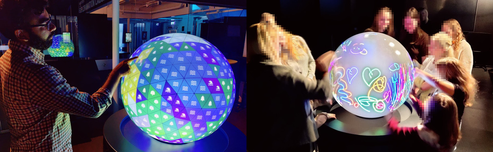

# TellUs - Planet Builder



A multi-demo application for [TellUs](https://visualiseringscenter.se/research-program/tellus/) ([PufferSphere](https://pufferfishdisplays.com/products/puffertouch/) by [Pufferfish](https://pufferfishdisplays.com/)), featuring interactive demos such as a tiled planet builder, a drawing application, a fish swarm simulation, and more experiments in development.


## Prerequisites

Before running Planet Builder, your system must meet the following requirements:

- **Windows 10/11** with Microsoft Edge & WebView2 (installed by default).
- **Python 3.13+** (Required for touch interaction): The app runs a background proxy script (`proxy.py`) to bridge TuIO touch events over UDP from the TellUs globe.

1. Download and install **[Python](https://www.python.org/downloads/)**
	- Check **"Add python.exe to PATH"** during setup
2. Install required dependencies:

```powershell
python -m pip install python-osc websockets
```


## Installation

### Option A: Download Executable

1. Download `PlanetBuilder.zip` from the [Latest Release](https://github.com/c-toolbox/TellUs-PlanetBuilder/releases/tag/latest)
2. Extract the archive

- **Install on TellUs:** Run `Planet Builder Installer.exe` to register the application to PufferConsole.
- **Run Standalone:** Execute `Planet Builder.exe` directly to test locally.


### Option B: Run from Source Code

If you want to modify code or develop new scenarios locally, follow these steps:

1. **Install Node.js 20** (via [NVM for Windows](https://github.com/coreybutler/nvm-windows/releases)):

```powershell
nvm install 20
nvm use 20
```

2. **Install & Launch:**

```powershell
npm install
npm run dev
```


## How to Use

To switch scenarios and adjust settings on the fly, you must run **[SocketUI](https://github.com/c-toolbox/TellUs-SocketUI)** alongside Planet Builder:

1. Download and start **SocketUI** from the [SocketUI Releases](https://github.com/c-toolbox/TellUs-SocketUI/releases/tag/latest).
2. Launch **Planet Builder** (via Pufferfish, `Planet Builder.exe` or `npm run dev`).
3. Open [http://localhost:7000](http://localhost:7000) in any browser (or on a smartphone connected to the local network).
	- If running on Pufferfish, locate the url used for the Pufferfish console (typically http://pufferfish or 127.168.1.xx) and add `:7000` at the end of the url.


## Testing Without a Physical Globe

If testing locally without Pufferfish hardware:

1. Download the [TUIO C++ Simulator](https://www.tuio.org/?cpp) and run `SimpleSimulator.exe`.
2. Touch input will be sent over localhost UDP port 3333 and forwarded to Planet Builder automatically.
